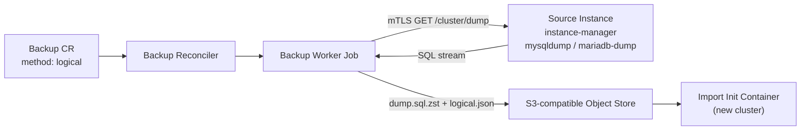

# Logical backups

:::caution Not implemented yet
This page describes the design in
[`design/028-logical-backups.md`](https://github.com/cnmsql/cnmsql/blob/main/design/028-logical-backups.md)
([#47](https://github.com/cnmsql/cnmsql/issues/47)). It is a draft and is left
out of production builds until the feature ships.
:::

A logical backup is a SQL dump of your application schemas, stored in the same
object store as your physical backups. Use it when a physical backup can't help:

- **Partial restore:** bring back one database without touching the others.
- **Moving across server versions:** load an 8.0 dump into a fresh 9.x cluster,
  or go back to an older series.
- **Exporting a schema** for a developer, a test environment or another tool.

Physical backups stay the right tool for disaster recovery and point-in-time
recovery. A logical backup is slower to take and much slower to restore on large
datasets, it is not a base for binlog replay, and it does not contain users or
grants.

| | Physical (`xtrabackup`) | Logical (`logical`) |
|---|---|---|
| Format | xbstream of the data directory | SQL (`dump.sql.zst`) |
| Restores onto | the same server series | any supported series of the same flavor |
| Restore granularity | whole cluster | whole dump or selected databases |
| Point-in-time recovery | yes, with binlog archiving | no |
| Users and grants | included | not included, declare them as CRs |
| Speed on large datasets | fast | slow (single-threaded dump and load) |

## How it works



The source instance manager runs the engine's dump client (`mysqldump` on
Percona Server, `mariadb-dump` on MariaDB) over its local socket and streams the
output to the backup worker Job over mTLS. The worker compresses the stream with
zstd, checksums it and uploads it. Object-store credentials never enter the
instance Pod, which is the same split as for
physical backups.

The dump runs as `cnmsql_dump`, a read-only account the operator creates on
every cluster. It can only connect over the instance's local socket. Its
password is in the `<cluster>-dump` Secret, which the backup worker Job sends
along with the dump request. Clusters created before logical backup support get
the account on the first reconcile after the operator upgrade, with no Pod
restart. Logical Backups wait in `Pending` (reason `DumpAccountNotReady`) until
the Cluster's `DumpAccountReady` condition is true.

Taking a logical backup needs an instance image that includes the dump tool.
Images published before logical backup support strip it. On such an image the
Backup fails with reason `LogicalToolUnavailable`; move the cluster to a newer
image tag of the same series (see [Instance Images and Versions](instance-images.md)).
The moving series tags (`8.4`, `11.4`, …) already point to images with the tool.
The first pinned tags that include it are:

| Image | First tag with the dump tool |
|---|---|
| `ghcr.io/cnmsql/cnmsql-instance` | `8.0-5`, `8.4-5`, `9.x-5` |
| `ghcr.io/cnmsql/cnmsql-mariadb-instance` | `10.11-4`, `11.4-4`, `11.8-4`, `12.3-4` |

Importing a dump works on any image.

Every dump is one consistent snapshot of all selected databases
(`--single-transaction`). Consistency covers InnoDB tables. Non-transactional
tables such as MyISAM can change while the dump runs.

## Taking a logical backup

```yaml
apiVersion: mysql.cnmsql.co/v1alpha1
kind: Backup
metadata:
  name: shop-dump
spec:
  cluster:
    name: shop
  method: logical
  target: prefer-standby
```

By default the dump contains every application schema. The system schemas
(`mysql`, `sys`, `performance_schema`, `information_schema`) and operator-owned
schemas such as `heartbeat` are always excluded. To dump only some databases:

```yaml
spec:
  method: logical
  logical:
    databases:
      - billing
      - catalog
```

With the plugin:

```bash
kubectl cnmsql backup shop --method logical --databases billing,catalog
```

`target`, `objectStore`, `reclaimPolicy` and `jobTemplate` work the same as for
physical backups (see [Physical Backup and Recovery](backup-recovery.md)). The
dump always runs online: `online: false` is rejected.

Taking the backup from a replica (`prefer-standby`, the default) is recommended.
The dump takes a brief global read lock at the start to record a consistent
binlog position, then reads for as long as the dump lasts.

### Scheduled logical backups

`ScheduledBackup` accepts the same `method` and `logical` fields:

```yaml
apiVersion: mysql.cnmsql.co/v1alpha1
kind: ScheduledBackup
metadata:
  name: shop-nightly-dump
spec:
  cluster:
    name: shop
  schedule: "0 0 3 * * *"
  method: logical
  successfulBackupsHistoryLimit: 7
```

A cluster often runs both: a physical schedule for disaster recovery and PITR,
and a logical one for exports and partial restores.

### Status

A completed logical Backup records:

- `status.method: logical`
- `status.destinationPath`: the `s3://` URI of `dump.sql.zst`
- `status.sha256`: checksum of the compressed object
- `status.databases`: the databases in the dump
- `status.beginGTID` / `status.endGTID`: the GTID set at the snapshot, for
  reference only

## Object-store layout

Logical backups live next to physical ones under the cluster prefix:

```text
<path>/<cluster>/<backup-name>/<backup-id>/dump.sql.zst
<path>/<cluster>/<backup-name>/<backup-id>/logical.json
```

The manifest is `logical.json`, not `metadata.json`. Recovery from a raw object
store (`bootstrap.recovery.source`) and binlog retention only look at physical
backups, so a dump is never picked as a recovery base by mistake.

`dump.sql.zst` is plain zstd-compressed SQL. You can inspect it without cnmsql:

```bash
aws s3 cp s3://cnmsql-backups/production/shop/shop-dump/<id>/dump.sql.zst - | zstd -d | less
```

## Importing into a new cluster

To load a dump into a fresh cluster, use `bootstrap.initdb.import`. The cluster
is initialised on its own server version, then the dump is loaded, so the target
can be a newer (or older) series than the source:

```yaml
apiVersion: mysql.cnmsql.co/v1alpha1
kind: Cluster
metadata:
  name: shop-84
spec:
  instances: 3
  imageName: ghcr.io/cnmsql/cnmsql-instance:8.4
  bootstrap:
    initdb:
      import:
        backup:
          name: shop-dump
        databases:
          - billing
  backup:
    objectStore:
      # ...
```

`databases` is optional. When set, only those databases are loaded from the
dump. Each one must be in the Backup's `status.databases`.

To import from an object store without a `Backup` object, for example in another
Kubernetes cluster, point at an `externalClusters` entry, as for raw-S3 recovery:

```yaml
spec:
  bootstrap:
    initdb:
      import:
        source: shop
        backupID: shop-dump-1760000000   # optional, latest dump when empty
  externalClusters:
    - name: shop
      objectStore:
        # ...
```

The import runs in an init container on the first instance, against a temporary
server with binary logging off. Replicas then clone the loaded primary as usual.
If the Pod restarts half-way, the import starts over and overwrites what was
already loaded.

`bootstrap.recovery.backup` does not accept a logical Backup. Recovery restores
a physical data directory; use `initdb.import` for dumps.

### Before you import

- **Declare users first.** The dump has no accounts. Create them with
  `spec.managed.roles`, `Database` or `DatabaseUser` objects. Views, routines
  and triggers keep their `DEFINER`, and they fail when called until that account
  exists.
- **Flavor must match.** A MySQL dump can't be imported into a MariaDB cluster,
  or the other way round.
- **Take a physical backup afterwards.** An imported cluster has no base backup,
  so point-in-time recovery starts only after its first physical backup.

## Retention and deletion

- `reclaimPolicy: Delete` on a logical Backup removes its directory from the
  object store when the Backup is deleted, like a physical backup.
- `ScheduledBackup` history limits apply per schedule.
- The cluster `spec.backup.retentionPolicy` also expires logical backups older
  than the window. It always keeps the newest one. Logical backups never affect
  which physical backups or binlogs are kept.

See [Backup Retention and Deletion](backup-retention-deletion.md).

## Limits

- Dump and load are single-threaded. For datasets in the hundreds of gigabytes,
  expect restores to take hours. Use physical backups for disaster recovery.
- Databases can't be renamed on import.
- Users, grants and system schemas are not included.
- Dumps are GTID-neutral: loading one does not change the target's
  `gtid_executed` or `gtid_purged`.
