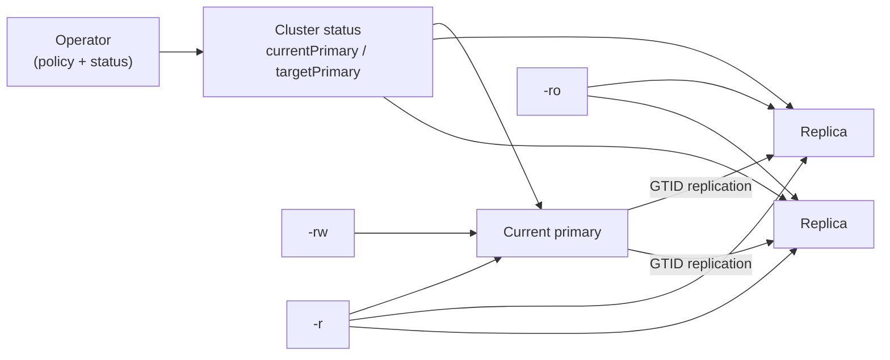

# Replication and failover architecture

CNMySQL builds a primary-replica topology with Percona Server for MySQL GTID
replication. The operator owns topology policy, while each instance manager
owns local mysqld role changes. This split keeps primary changes declarative:
the operator writes the intended primary in Cluster status, and the pods
converge themselves toward that target.



## Replication model

Replicas are created from a physical XtraBackup stream taken from the current
primary. After prepare and copy-back, the instance manager configures MySQL with
GTID auto-positioning so it follows the primary from the restored GTID point.

MySQL transport TLS is rendered for every instance. Replication uses the
per-instance certificate material and a dedicated replication account requiring
X509. The application-facing `require_secure_transport` setting remains a user
choice through `spec.mysql.parameters`.

Semi-synchronous replication can be enabled with:

```yaml
spec:
  instances: 3
  minSyncReplicas: 1
  maxSyncReplicas: 1
  mysql:
    semiSync:
      enabled: true
      timeoutMillis: 1000
```

Semi-sync improves failover durability when configured so acknowledged commits
reach at least one replica. Without that guarantee, an acknowledged write that
only existed on a lost primary can be lost before a replica or the object store
sees it.

### Semi-sync self-healing (data durability)

With semi-sync on, the primary blocks each commit until `minSyncReplicas`
replicas acknowledge it. If a synchronous replica becomes unhealthy, that floor
can stall writes. `spec.mysql.semiSync.dataDurability` decides how the operator
responds:

```yaml
spec:
  minSyncReplicas: 2
  mysql:
    semiSync:
      enabled: true
      dataDurability: preferred # or "required"
```

With `preferred` (the default), the operator keeps lowering the primary's
required acknowledgement count
(`rpl_semi_sync_source_wait_for_replica_count`) to the number of healthy
replicas, never below one, so writes keep flowing during a replica outage. It
raises the count back to `minSyncReplicas` as replicas recover. This favours
availability over strict durability.

With `required`, the count stays pinned to `minSyncReplicas`. When fewer healthy
replicas can acknowledge, writes block until `timeoutMillis` elapses and
replication falls back to async. This favours durability over availability.

The operator applies the change on the primary over the mTLS control API during
its steady-state reconcile. It is a runtime adjustment only; the static
`my.cnf` floor does not change.

### Liveness isolation check

Each cluster-managed instance keeps probing the Kubernetes API server. If it
cannot reach the API server for 30 seconds it treats itself as network-isolated
and fails its liveness probe, so the kubelet restarts the container. This is a
last-resort guard against a partitioned primary the operator can no longer
coordinate, which is a split-brain risk. The check runs locally inside the
instance, so a genuinely isolated node still restarts itself even while it is
unreachable from the control plane.

## Role services

CNMySQL creates three default Services:

- `<cluster>-rw`: selects the current primary.
- `<cluster>-ro`: selects ready replicas.
- `<cluster>-r`: selects any ready instance.

Default Services can be disabled by name (the `rw` service cannot be disabled):

```yaml
spec:
  managed:
    services:
      disabledDefaultServices:
        - ro
```

### Customising default services

A shared `template` is merged onto the three default Services, letting you change
their `type` and add labels and annotations. The operator always owns the
selector and the `mysql:3306` port.

```yaml
spec:
  managed:
    services:
      template:
        metadata:
          labels:
            app.kubernetes.io/part-of: my-app
          annotations:
            service.beta.kubernetes.io/aws-load-balancer-scheme: internal
        spec:
          type: LoadBalancer
```

### Additional services

You can declare extra Services routed to a role (`rw`, `ro`, or `r`). Each entry
is rendered as `<cluster>-<name>` and carries its own template. `updateStrategy:
patch` (default) merges your template onto the role defaults; `replace` swaps
them entirely, keeping only the operator-owned selector, ports, and owner-tracking
labels. Additional service names must be unique and must not collide with the
default `rw`/`ro`/`r` names.

```yaml
spec:
  managed:
    services:
      additional:
        - name: mysql-lb
          selectorType: rw
          serviceTemplate:
            spec:
              type: LoadBalancer
        - name: mysql-internal-read
          selectorType: ro
          updateStrategy: replace
          serviceTemplate:
            metadata:
              labels:
                pool: reporting
            spec:
              type: ClusterIP
```

The user-customisable spec fields are `type`, `externalTrafficPolicy`,
`sessionAffinity`, `loadBalancerSourceRanges`, `externalName`, and
`healthCheckNodePort`. The selector, ports, and `clusterIP` are operator-managed
and cannot be overridden. Per-instance headless Services remain internal
`ClusterIP: None` and are not user-configurable.

Service routing is driven by Pod labels. The operator updates labels only after
the database role change is considered safe, so client traffic follows the
observed MySQL topology.

## Dynamic role reconciliation

Every instance starts read only. The in-pod role reconciler watches the owning
`Cluster` and compares its own name with `status.targetPrimary` and
`status.currentPrimary`.

If the pod is the target primary, it drains replication state, promotes itself,
clears read-only mode, and writes `status.currentPrimary`.

If the pod is not the target primary, it stays or becomes read only and follows
the current primary. A diverged instance is kept read only and is not silently
re-cloned over its retained PVC.

## Planned switchover

A planned switchover promotes a named healthy replica. CNMySQL models this like
CloudNativePG: the request is a status transition rather than a spec change.
The normal trigger is to set `status.targetPrimary` to a replica name.

The operator then:

1. validates that the target exists, is ready, is a replica, and has healthy
   replication threads;
2. checks that the target GTID set contains the old primary's observed GTID set;
3. demotes the old primary while it is still reachable;
4. lets the target promote itself;
5. reconfigures remaining replicas to follow the new primary;
6. updates role labels, Services, `currentPrimary`, and conditions.

`spec.maxSwitchoverDelay` bounds how long the target may take to catch up before
the switchover is aborted and surfaced as blocked.

## Automatic failover

Automatic failover begins when the established primary is unreachable or not
healthy. The operator records when the primary first started failing and waits
for `spec.failoverDelay`. A value of `0` means immediate failover.

After the delay, the operator selects a candidate only if it can prove the move
is safe enough:

- the candidate must be ready and a replica;
- replication SQL state must be healthy and free of a last error;
- GTID sets must be comparable;
- the chosen candidate must contain the best known GTID history among
  candidates.

If the GTID sets are divergent or no safe candidate exists, failover is blocked
instead of risking data loss.

During failover, the old primary is fenced by removing its primary role and
deleting its Pod while retaining the PVC. The promoted replica becomes
`currentPrimary`, and surviving replicas follow it.

## Former primary rejoin

When a fenced or crashed primary returns, it does not automatically become
primary again. It boots read only, observes Cluster status, and attempts to
follow the promoted primary.

If its GTID set is contained in the new primary's GTID set, it can safely rejoin
as a replica. If it contains errant transactions that the promoted primary never
saw, CNMySQL marks it diverged and keeps it out of service. The retained PVC is
left for deliberate human recovery instead of being destroyed.

## Status and events

Useful status fields during topology changes:

- `currentPrimary`: the instance currently accepted as primary.
- `targetPrimary`: the desired primary.
- `currentPrimaryTimestamp`: when the current primary became primary.
- `targetPrimaryTimestamp`: when a primary change was requested.
- `primaryFailingSince`: when the current primary became unhealthy.
- `divergedInstances`: instances excluded because their GTID set is unsafe.
- `gtidExecutedByInstance`: last observed GTID state per instance.

Watch Events for phase transitions such as switchover, failover, fencing, and
blocked operations. The operator also reports `Ready`, `Progressing`, and
`Degraded` conditions on the Cluster.

## Operational notes

- Use three instances for meaningful automatic failover.
- Prefer semi-sync when the recovery objective requires acknowledged writes to
  survive primary loss.
- Keep failover delay low for availability, but high enough to avoid promoting
  during transient node or network blips.
- Do not manually write to a replica or recovered former primary. Errant GTIDs
  intentionally block automatic rejoin.
- Do not delete retained PVCs until you have decided the data is no longer
  needed for diagnosis or manual recovery.

## Verification coverage

Unit tests cover GTID parsing and containment, candidate selection, switchover
validation, failover delay, blocked failover, role-label updates, and divergence
detection. Kind e2e coverage validates planned switchover, automatic failover by
primary Pod deletion, service rerouting, writes after promotion, and compatible
former-primary rejoin.
